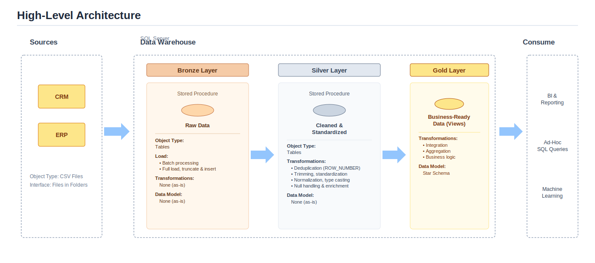
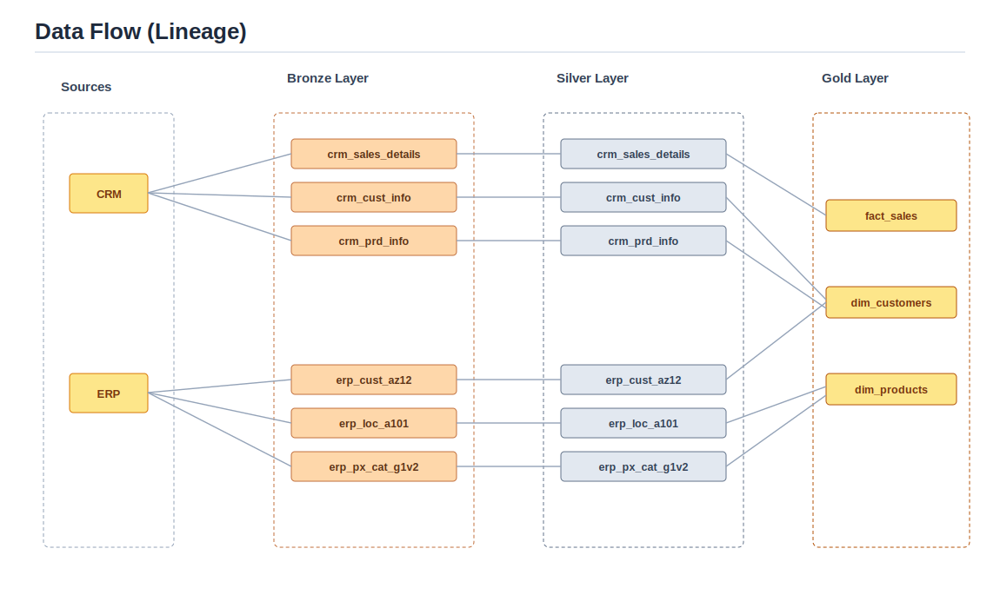
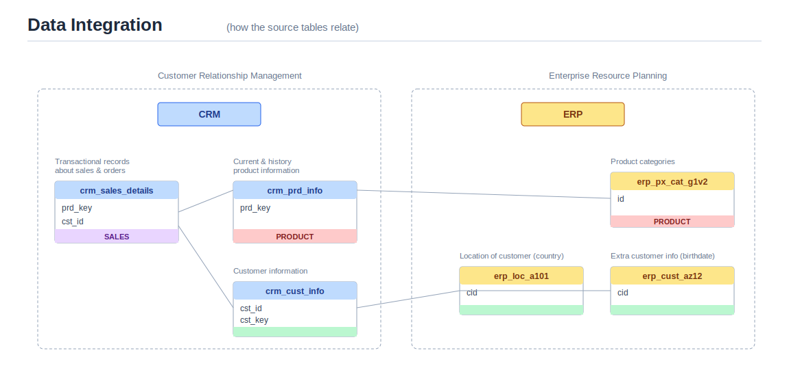
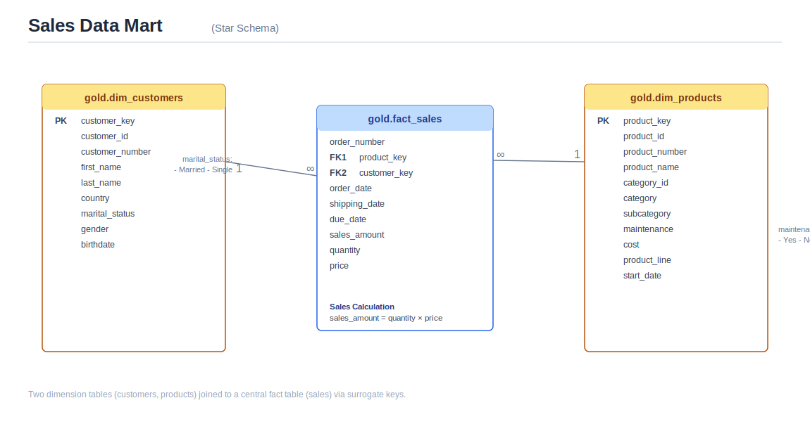
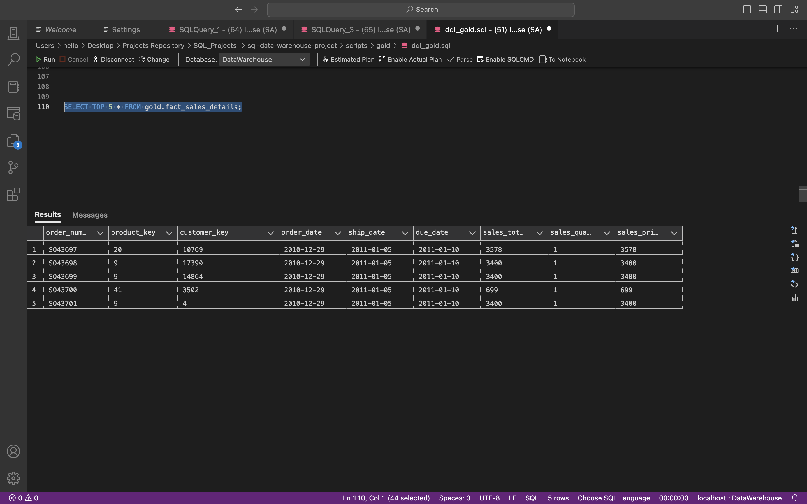

# End-to-End SQL Data Warehouse & ETL Pipeline

A multi-layered (Bronze → Silver → Gold) data warehouse built in Microsoft SQL Server, running in Docker. It ingests raw CRM and ERP source files, applies systematic data cleansing and validation, and surfaces a business-ready **Star Schema** for reporting and analysis.

> **Attribution:** This project was built as an independent, hands-on implementation inspired by the data warehouse architecture patterns taught by Data With Baraa. All schema design, SQL development, debugging, and Docker environment setup were carried out independently.

---

## Architecture



The pipeline is organized into three schemas inside a single SQL Server database, each with a distinct responsibility:

| Layer | Purpose | Object Type |
|---|---|---|
| **Bronze** | Raw ingestion — CSV data loaded as-is, no transformations | Tables |
| **Silver** | Cleansing, standardization, deduplication, business rules | Tables |
| **Gold** | Business-ready, dimensionally modeled data | Views (Star Schema) |

### Data Flow



Six source files — three from CRM (`crm_cust_info`, `crm_prd_info`, `crm_sales_details`) and three from ERP (`erp_cust_az12`, `erp_loc_a101`, `erp_px_cat_g1v2`) — flow through each layer and converge into three Gold objects: `fact_sales_details`, `dim_customers`, and `dim_products`.

### Data Integration



CRM and ERP are independent source systems with no shared keys by design — customer and product records are reconciled downstream using overlapping business keys (`cst_key` ↔ `cid`, `cat_id` ↔ category codes derived from the product key).

### Gold Layer — Star Schema



---

## Tech Stack

- **Microsoft SQL Server 2022** (containerized with Docker)
- **T-SQL** — stored procedures, views, window functions
- **Docker** — isolated, reproducible database environment
- Source data: flat CSV exports from CRM and ERP systems

---

## Repository Structure

```text
├── Datasets/                     # Raw CSV source files (CRM & ERP)
├── images/                       # Architecture and data model diagrams
├── Scripts/
│   ├── init_database.sql         # Creates the database and bronze/silver/gold schemas
│   ├── Bronze Layer/
│   │   ├── bronze_tables.sql     # DDL for raw staging tables
│   │   └── bronze_load_process.sql   # BULK INSERT procedure (source -> bronze)
│   ├── Silver Layer/
│   │   ├── silver_tables.sql     # DDL for cleansed tables
│   │   └── silver_load_proc.sql  # Cleansing & transformation procedure (bronze -> silver)
│   └── Gold Layer/
│       └── ddl_gold.sql          # Star schema views (silver -> gold)
└── README.md
```

---

## How to Run

1. **Start SQL Server in Docker**
   ```bash
   docker run -e "ACCEPT_EULA=Y" -e "MSSQL_SA_PASSWORD=<your_password>" \
     -p 1433:1433 --name sql_dw -d \
     -v /local/path/to/Datasets:/var/opt/mssql/data \
     mcr.microsoft.com/mssql/server:2022-latest
   ```
   The `-v` volume mount makes the CSV files available inside the container at `/var/opt/mssql/data`, which is the path `BULK INSERT` reads from.

2. **Initialize the database and schemas**
   Run `Scripts/init_database.sql` — creates the `DataWarehouse` database and the `bronze`, `silver`, and `gold` schemas.

3. **Build and load the Bronze layer**
   Run `Scripts/Bronze Layer/bronze_tables.sql`, then execute `bronze.load_bronze` from `bronze_load_process.sql`.

4. **Build and load the Silver layer**
   Run `Scripts/Silver Layer/silver_tables.sql`, then execute `silver.load_silver` from `silver_load_proc.sql`.

5. **Create the Gold layer views**
   Run `Scripts/Gold Layer/ddl_gold.sql` to create `gold.dim_customers`, `gold.dim_products`, and `gold.fact_sales_details`.

6. **Query the warehouse**
   ```sql
   SELECT * FROM gold.fact_sales_details;
   ```

---

## Key Transformation Logic

The Silver layer is where most of the real data-quality work happens:

- **Deduplication** — `ROW_NUMBER() OVER (PARTITION BY cst_id ORDER BY cst_create_date DESC)` keeps only the most recent customer record per ID.
- **Categorical standardization** — codes like `M`/`S` and `M`/`F` are mapped to readable values (`Married`/`Single`, `Male`/`Female`); unrecognized or missing values fall back to `'n/a'` rather than nulls, keeping downstream joins and reports predictable.
- **Derived keys** — product category IDs are extracted from the product key itself (`REPLACE(SUBSTRING(prd_key, 1, 5), '-', '_')`), and product end dates are inferred using `LEAD()` over each product's start-date history.
- **Business rule validation** — sales amounts are recalculated (`quantity × price`) whenever the stored `sls_sales` value is missing, zero, or inconsistent with quantity and price, rather than trusting the source value blindly.
- **Invalid date handling** — integer-encoded dates (`YYYYMMDD`) are checked for length and validity before casting; malformed values become `NULL` instead of causing load failures.
- **Hidden character cleanup** — country and maintenance fields had embedded carriage returns/line feeds (`CHAR(13)`/`CHAR(10)`) from the source export, stripped explicitly before standardization (e.g., `DE` → `Germany`, `US`/`USA` → `United States`).
- **Cross-system key reconciliation** — ERP customer IDs prefixed with `NAS` are stripped to match CRM keys; location IDs have embedded dashes removed for the same reason.

---


## Sample Output

```sql
SELECT TOP 5 * FROM gold.fact_sales_details;
```


